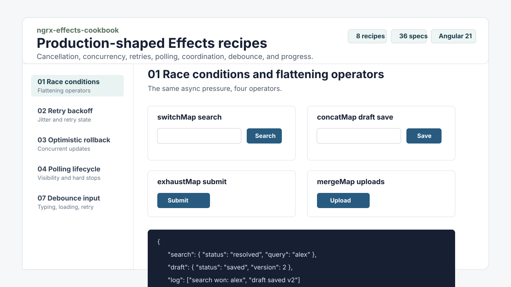

# ngrx-effects-cookbook

Production-shaped Angular NGRX Effects recipes for the timing problems that appear once an app has real users: racing requests, retries, optimistic rollbacks, polling lifecycle leaks, route cancellation, cross-effect coordination, debounced input, and long-running progress streams.

[](https://github.com/mohamad-kayal/ngrx-effects-cookbook/actions/workflows/ci.yml)




## Why this exists

The official docs teach the APIs. This repo focuses on the failure modes that are harder to reason about from reference docs alone: a stale search response wins, a save is cancelled mid-flight, a retry hammers a 401, a polling stream keeps running after logout, or an optimistic rollback clobbers a newer user action.

This repo is a focused reference for those edges. It is about Effects, not NGRX basics, Entity Adapter, or Signal Store.

## Highlights

- Angular standalone demo app with one lazy route per recipe.
- Eight copyable recipe folders, each shaped as a complete feature slice: actions, reducer, selectors, effects, mock backend, component, diagram, and tests.
- Functional NGRX Effects backed by pure factory functions for direct virtual-time testing.
- Timing-focused Jest and RxJS `TestScheduler` specs for concurrency, cancellation, retry, route exits, and progress streams.
- Mermaid diagrams and decision matrices so each pattern is easy to reason about before copying code.

## Recipes

| Recipe | Why it exists |
|---|---|
| [01 Race conditions & flattening operators](recipes/01-race-conditions/README.md) | Choose `switchMap`, `concatMap`, `mergeMap`, or `exhaustMap` by failure mode, not habit. |
| [02 Retry with exponential backoff + jitter](recipes/02-retry-backoff/README.md) | Use modern `retry({ delay })`, skip non-retryable errors, and surface retry state to the UI. |
| [03 Optimistic updates with rollback](recipes/03-optimistic-rollback/README.md) | Roll back failed optimistic changes without clobbering newer pending updates. |
| [04 Polling lifecycles](recipes/04-polling-lifecycle/README.md) | Start, stop, pause on tab visibility, back off on errors, and hard-stop on logout or route exit. |
| [05 Cancellation on route change](recipes/05-cancel-on-route/README.md) | Cancel app-scoped effects when the page that needed the request goes away. |
| [06 Cross-effect coordination](recipes/06-cross-effect-coordination/README.md) | Let effect B wait for effect A without direct effect-to-effect coupling. |
| [07 Debouncing user input to an API](recipes/07-debounce-input/README.md) | Split typing and loading states, skip duplicates, cancel empty input, and cancel stale requests. |
| [08 Long-running tasks with progress](recipes/08-long-running-progress/README.md) | Feed server-pushed progress events into the store, with cancellation and finalization. |

## Tech stack

- Angular 21 standalone APIs and lazy route components.
- NGRX 21 Store, Effects, Store Devtools, and `@ngrx/operators`.
- RxJS 7 streams, cancellation, retries, timers, and virtual time.
- Jest 30 with `jest-preset-angular` and `TestScheduler` coverage.
- ESLint, Prettier, TypeScript strict mode, and GitHub Actions CI.

## Project structure

```text
apps/demo/          Angular demo shell and routed recipe pages
recipes/            One complete NGRX feature slice per recipe
docs/assets/        README and presentation assets
.github/workflows/  CI verification for Node 20 and 22
```

## Getting started

Requires Node `>=20 <23` and npm `>=10`.

```bash
npm install
npm start
```

Open `http://localhost:4200` and use the left nav to poke each recipe. The mock backends are intentionally local RxJS streams: `timer`, `of`, `throwError`, and a few fail-next toggles.

## Quality gate

```bash
npm run verify
```

The full gate runs linting, the Jest suite, and a production Angular build. The current suite has 36 specs covering happy paths, failure modes, cancellation, retry caps, route exits, out-of-order optimistic acknowledgements, and debounced retry behavior.

You can also run the pieces individually:

```bash
npm run lint
npm test
npm run build
```

## Implementation style

The demo app uses standalone Angular providers:

- `provideStore()` and route-level `provideState(...)`
- functional effects via `createEffect(..., { functional: true })`
- route-level `provideEffects(...)`
- path aliases like `@recipes/race-conditions`

Each effect file exports pure factory functions first, then wraps them in functional effects. That keeps the production code idiomatic while making the timing tests small and direct.

## Roadmap

- Deploy the demo to GitHub Pages after the repository is created.
- Add a short negative-test appendix showing the wrong-way snippets failing the same specs.
- Split a follow-up repo for Signal Store patterns rather than mixing paradigms here.

## Suggested GitHub topics

`angular`, `ngrx`, `ngrx-effects`, `rxjs`, `typescript`, `frontend`, `state-management`, `jest`, `testing`, `cookbook`

## License

MIT

## Why I built it

NGRX at scale is mostly about timing, ownership, and cancellation. These are the decisions that make an app feel boring in production, in the best possible way.