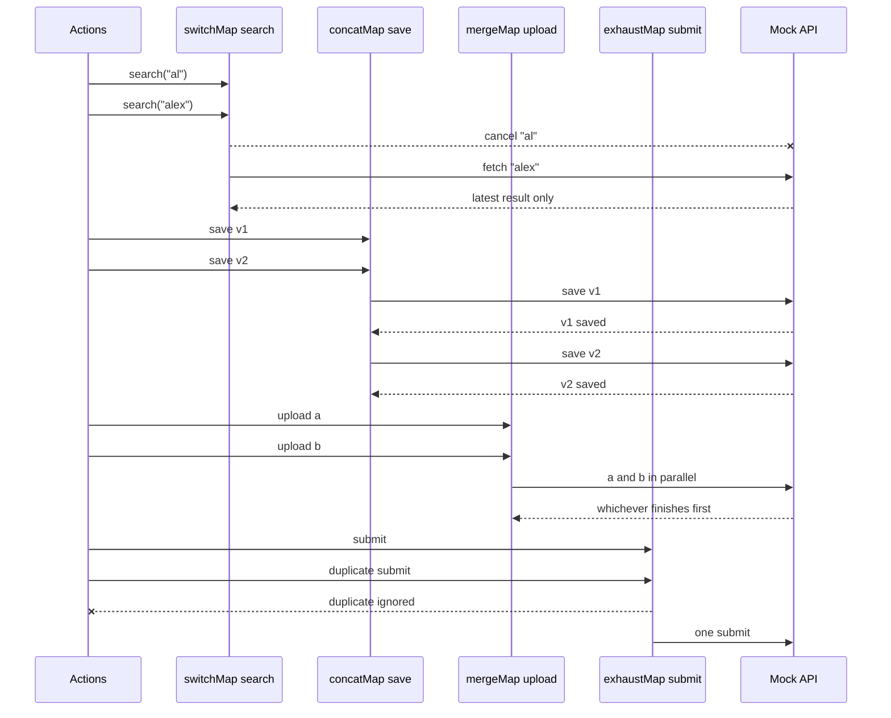

# Race conditions & flattening operators

| Operator | In-flight behavior | Good fit | Dangerous fit |
|---|---|---|---|
| `switchMap` | Cancels previous inner observable | Reads, typeahead | Writes that must finish |
| `concatMap` | Queues work | Ordered writes | High-volume search |
| `mergeMap` | Runs work in parallel | Independent writes | Last-write-wins updates |
| `exhaustMap` | Ignores new triggers | Submit/login buttons | Retry buttons |