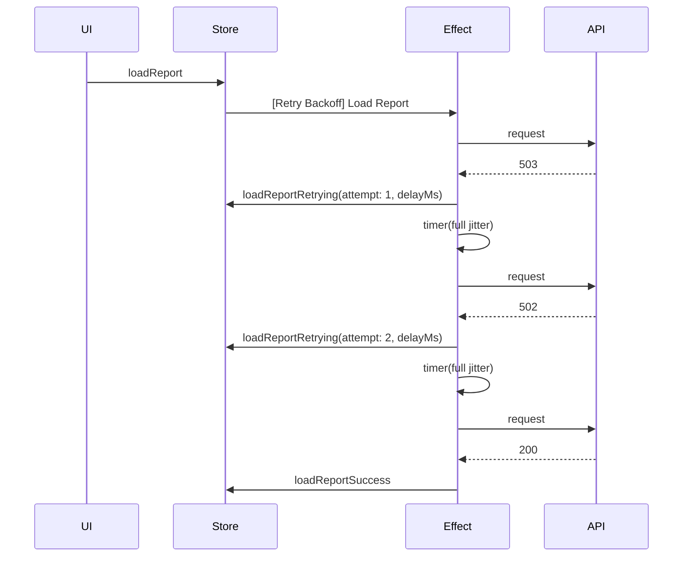

# Retry with exponential backoff + jitter

Non-retryable statuses (`400`, `401`, `403`, `404`, `422`) return `throwError` from the retry `delay` callback. That short-circuits the retry chain and lets the final `catchError` surface the error immediately.