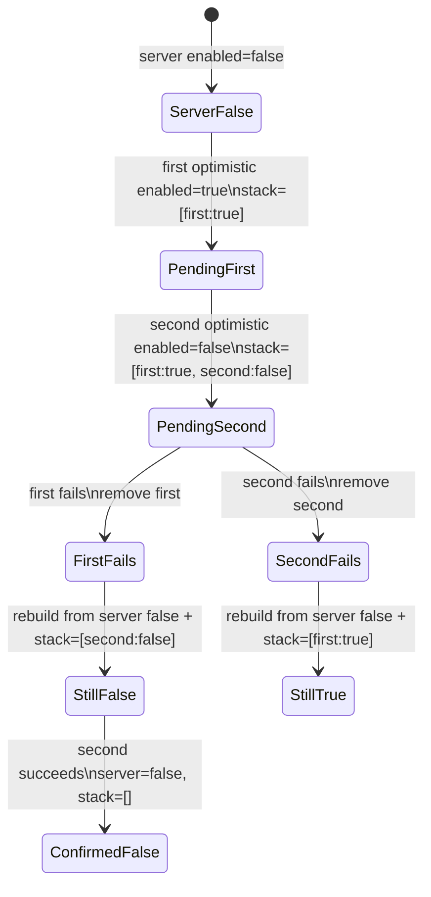

# Optimistic updates with rollback

The important move is rebuilding the visible entity from `serverEntities[id]` plus the remaining pending stack after every success or failure. No action ever rolls back to a single global `previous` value.