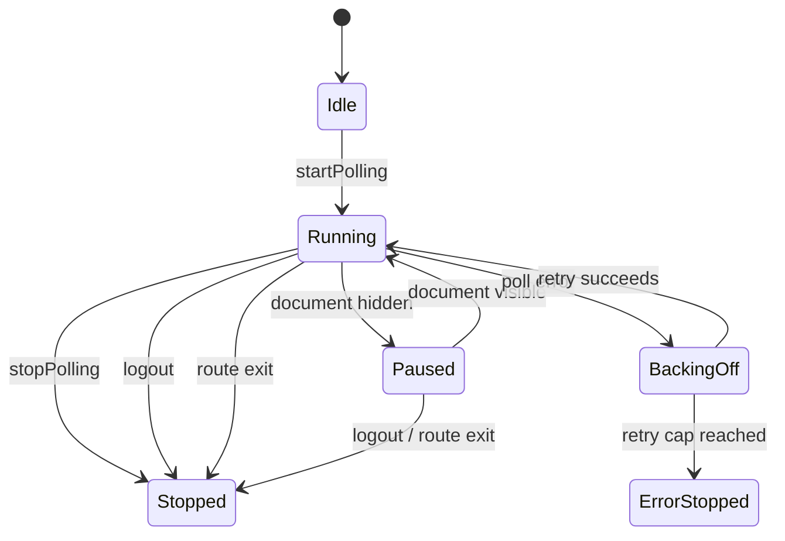

# Polling lifecycles

The effect switches the interval source on and off from the visibility stream. While hidden, it switches to `EMPTY`; it does not keep an interval ticking and merely skip fetches.