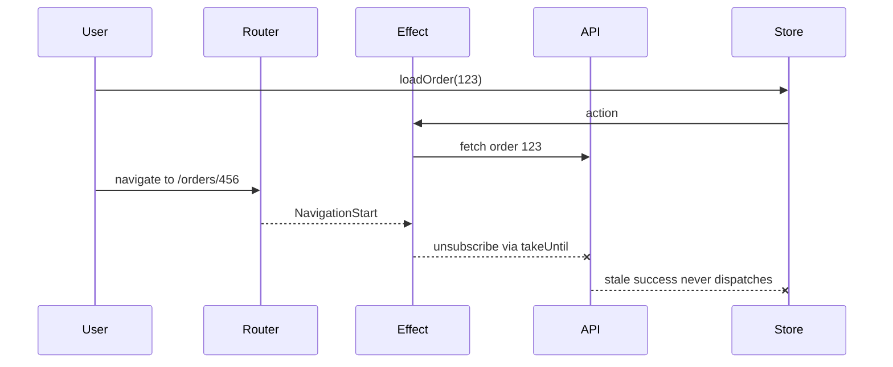

# Cancellation on route change

The explicit-action version replaces `NavigationStart` with `cancelLoadOrder`. The cancellation mechanism is the same: the cancel stream is inside the inner observable, next to the request it owns.