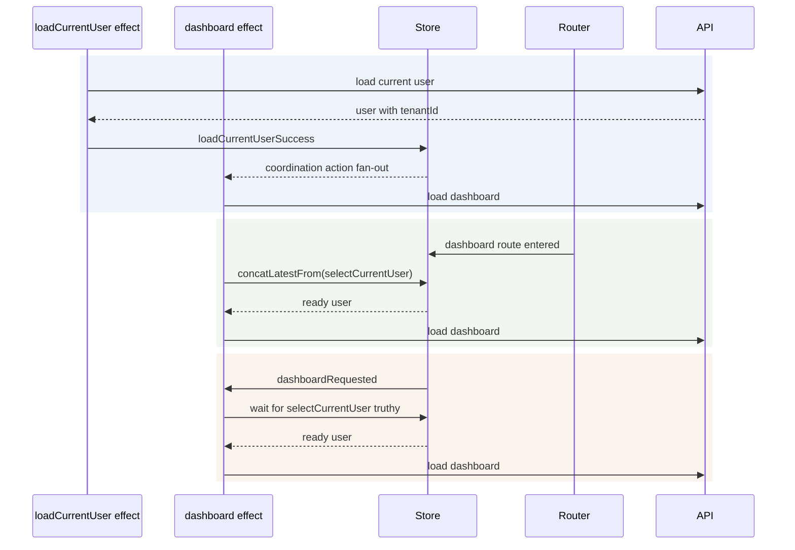

# Cross-effect coordination

Pattern A is best for fan-out. Pattern B is best when navigation owns the dependency. Pattern C is useful when the user action arrives before readiness and should wait instead of being dropped.