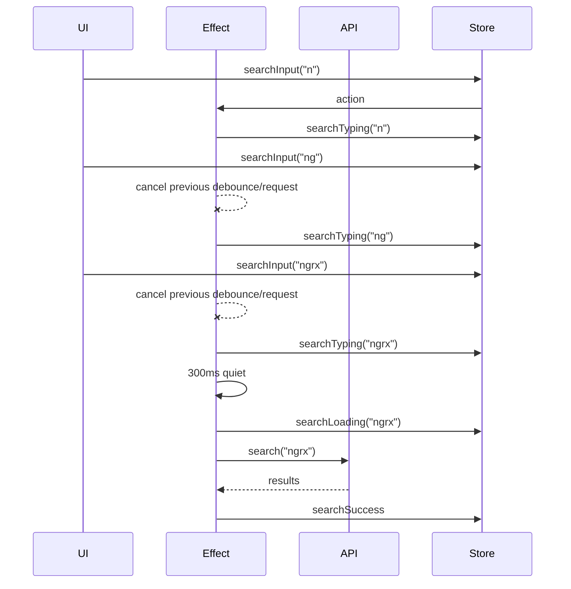

# Debouncing user input to an API

The effect uses `switchMap` around the whole debounce-plus-request unit. That means the next keystroke cancels not only the timer, but also a request that has already started.