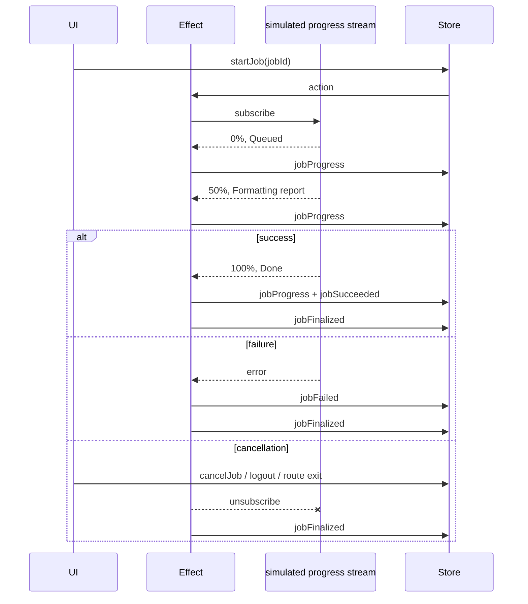

# Long-running tasks with progress

The transport is an `Observable<JobProgressEvent>`. Replacing `simulateProgress` with `webSocket()` or an `EventSource` wrapper does not change the reducer or tests.